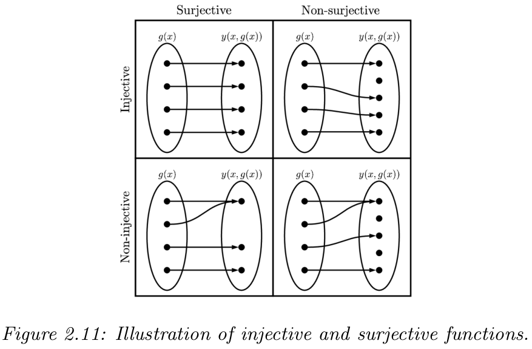
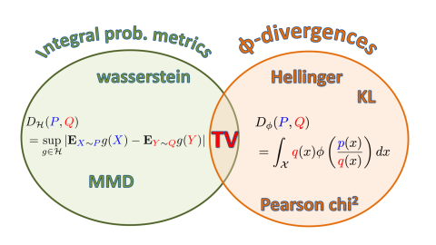

$\newcommand{\bs}[1]{\boldsymbol{#1}}$
$\renewcommand{\vec}[1]{\bs{#1}}$

# 2 Probability

WIP $\ldots$

## 2.5 Transformations of random variables

- We want to go from $\vec{x}\sim p_x(\vec{x})$ to $\vec{y}\sim p_y(\vec{y})$ where $f(\vec{x})=\vec{y}$ is deterministic.

### 2.5.1 Invertible transformations (bijections)
- We can achieve the variable transformation using the determinant of the **Jacobian** of the inverse $f^{-1}$ and $f$ should be a bijection (aka surjective and injective, so it goes from $\mathbb{R}^n\rightarrow\mathbb{R}^n$, $f$ has a well defined inverse): $p_y(\vec{y}) = p_x(\vec{x}) \left|\det[\mathbf{J}_{f^{-1}}(\vec{y})]\right|$
    - where: $\mathbf{J}_{f^{-1}}(y)=\left[\begin{array}{lll}
\frac{\partial \vec{x}}{\partial y_1} & \cdots & \frac{\partial \vec{x}}{\partial y_n}
\end{array}\right]=\left[\begin{array}{c}
\nabla^{\mathrm{T}} x_1 \\
\vdots \\
\nabla^{\mathrm{T}} x_n
\end{array}\right]=\left[\begin{array}{ccc}
\frac{\partial x_1}{\partial y_1} & \cdots & \frac{\partial x_1}{\partial y_n} \\
\vdots & \ddots & \vdots \\
\frac{\partial x_n}{\partial y_1} & \cdots & \frac{\partial x_n}{\partial y_n}
\end{array}\right]$

### 2.5.2 Monte Carlo Approximation
- It is often expensive to compute the Jacobian mat so we use Monte Carlo: based on samples $\vec{x}^s\sim p(\vec{x})$ compute $\vec{y}^s\sim f(\vec{x}^s)$ and then construct an empirical pdf $p(\vec{y})$ 

### 2.5.3 Probability Integral Transform (PIT)
- Basically is a transformation of any pdf to a uniform dist (uses cdf), it is useful because we can define unbiased samples 
- PIT results in $Y$ having a uniform dist given that: $Y(X)=P_X(X)$ is a transformation of the rv $X$, where $X$ has $P_X$ as its cdf.
- The steps are: take samples $x_n\sim p_x$, then compute the empirical cdf $Y=P_X(X)$; then compute the empirical pdf of $Y$ using **kernel density estimates**

## 2.6 MARKOV CHAINS
- The last state $x_t$ captures all relevant info thus it is a *sufficient statistic* to estimate the future state: $p(x_{t+\tau} | x_t)$, this is called the **Markov Assumption**
- A **Markov Chain** is the joint probability of any sequence of events:
$p(x_{1:T}) = p(x_1) \prod_{t=2}^{T} p(x_t | x_{t-1})$

### 2.6.1 Parametrization
#### 2.6.1.1 Markov transition kernels
- A **transition function / kernel / Markov kernel** is just a conditional dist $p(x_t | x_{t-1})$ that depends on the last state. It satisfies the Kolgomorov axioms
- If we assume that the transition function is *time-independent* then the model is said to be **homogeneous, stationary, or time-invariant**
- The assumption of modeling an arbitrary number of variables w/ fixed number of params is called **parameter typing** (time-invariant is an example of this)

#### 2.6.1.2 Markov transition matrices
- This section deals with discrete vars $X_t \in {1, \ldots, K}$ called **finite-state** Markov chain
- The conditional dist can be written as a $K \times K$ transition matrix $A_{ij} = p(X_t=j | X_{t-1}=i)$ gives the prob of going from state $i$ to state $j$ (each row sums to 1, this is called a **stochastic matrix**)
- Now we want to get from state $i$ to state $j$ in $n$ steps, what is this prob? Thanks to **Chapman-Kolgomorov** equations this is just powering up a transition matrix $n$ times
    - $A_{ij}(n) = p(X_{t+n}=j | X_t=i)$
    - $\mathbf{A}(n) = \mathbf{A}^n$
    
#### 2.6.1.3 Higher-order Markov chains
- We can generalize the last case to higher dimensions ie. a model of order w/ memory length $n$, called **Markov model of order n / n-gram model**:
    - $p(\vec{x}_{1:T}) = p(\vec{x}_{1:n}) \prod_{t=n+1}^T p( \vec{x}_t | \vec{x}_{t-n:t-1})$
    - If $n=1$ this is called a **bigram model** (because we need to represent pairs of chars $p(\vec{x}_t\mid\vec{x}_{t-1})$), $n=2$ is trigram (we need to represent triplets $p(\vec{x}_t\mid\vec{x}_{t-1},\vec{x}_{t-2})$), and so on …
- A powerful property is that we can always convert higher-order models to first-order by defining an augmented state space
    - eg. for an $n=2$ bigram model, we can define: $\tilde{\vec{x}}_t=(\vec{x}_{t-1},\vec{x}_t)$
    - and then use: $p(\tilde{\vec{x}}_{1:T})=p(\tilde{\vec{x}}_2)\prod_{t=3}^T p(\tilde{\vec{x}}_t\mid\tilde{\vec{x}}_{t-1})$
- Because of the above property we'll focus on first-order models in the following sections
    
### 2.6.2 Application: language modeling
- Markov models have application in LMs, ie. models that can generate (score) a sequence of words 
- conditional language models can be used to generate
sequences given inputs, such as mapping one language to another, or an image to a sequence, etc

### 2.6.3 Parameter Estimation
- Will see how to estimate params of a Markov model

#### 2.6.3.1 Maximum likelihood estimation (MLE)
- The main idea behind MLE is to find the parameter values that maximize the likelihood of observing the given data from a probability function
- Since Markov models have previous states as parameters then its transition matrix contains all the useful info. So MLE is used to estimate the transition states
- Remember that this is basically maximizing the log prob
    - eg. for order 1: $p(x_{1:T}|\vec{\theta}) = \pi(x_1)A(x_1,x_2)\ldots A(x_{T-1},x_T)$ (notation in Markov models: $\pi(x)=p(x)$)
    - This can be  written w/ prods $\prod$ (eq.2.275) and then generalized to $\mathcal{D}=(\vec{x}_1,\ldots,\vec{x}_N)$ where the chain $\vec{x}_i$ is $\vec{x}_i=(x_{i1},\ldots,x_{iN})$ 
    - After taking the log and defining counts we arrive to eq.2.276: $\log p(\mathcal{D}|\vec\theta) = \sum_{i=1}^N\log(p(\vec{x_i}|\vec{\theta}))=\sum_jN^1_j\log\pi_j+\sum_j\sum_kN_{jk}\log A_{jk}$ 
        - $N_j^1$: represents the number of transition states where state $j$ is the starting state
        - $N_{jk}$: number of transition states from $j$ to $k$ (**bigram statistics**)
        - $N_j$: number of times state $j$ is involved in a state transition (**unigram statistics**)
    - Then we maximize the log likelihood using *Lagrange multipliers* and find the estimates for Markov models: $\hat{\pi}_j=\frac{N_j^1}{\sum_{j^\prime}N_{j^\prime}^1}$ and $\hat{A}_{jk}=\frac{N_{jk}}{N_j}$
    
#### 2.6.3.2 Sparse data problem
- If we want to fit n-gram models (past state memory) to text data, for large $n$ we face huge overfitting problems due to sparsity (most words in any training dataset are not linked)
- Thus if we have a chain of length $K$ (# words in dataset), and context $K^{n-1}$ (**context** / past states), then we'll have a sparse matrix of $K\times K$, beacuse most $N_{jk}$ are zero
- Brute force attempts to overcome this have been used in the past [[HNP09](https://static.googleusercontent.com/media/research.google.com/en//pubs/archive/35179.pdf)], but ideally we wouldn't like to NOT be able to predict a particular word just because it is not in our training set

#### 2.6.3.3 MAP estimation
- A simple initial solution to the sparsity problem is to use the *Dirichlet prior* $\mathbf{A}_{j:}\sim \text{Dir}[\alpha\mathbf{1}]$
- The Maximum a Posteriori MAP estimate for transition states is $\hat{A}_{jk}=\frac{N_{jk}+\alpha}{N_j+K\alpha}$ (if $\alpha=1$ is called **add-one-smoothing**)
    - The problem with add-one-smoothing is that it assumes that all n-grams are equally likely (not realistic)
    - More sophisticated approach in Sec.3.7.3, hierarchichal Bayes

### 2.6.4 Stationary distribution of a Markov chain
- Stationary distribution = prob dist that remains unchanged over time

#### 2.6.4.1 What is a stationary distribution?
- The stationary distribution has the interpretation of the limiting distribution when the chain is irreducible and aperiodic
- The formulation is as follows: 
    - the **stationary / equilibrium distribution** case is when (eg in the 1-step transition-mat case) $\vec{\pi}_t = \vec{\pi}_{t-1}\mathbf{A}$ reaches $\vec{\pi} = \vec{\pi}\mathbf{A}$ after some iterations, regardless of the initial state dist (eg. prob of being in state $j$ at time $t$ $\pi_t(j)=p(X_t=j)=\sum_{i}\pi_{t-1}A_{ij}$)
    - In general we have the **global balance equations** $\pi_i\sum_{j\neq i}A_{ij} = \sum_{j\neq i}\pi_jA_{ji}$, subject to normalized marginal probs ($=\sum_j\pi_j=1$), so the prob of being in state $i$ times the net flow out of state $i$ must equal the probability of being in each other state $j$ times the net flow from that state into $i$
    
#### 2.6.4.2 Computing the stationary distribution
- The whole thing above is similar to solving an eigenvalue problem $\mathbf{A}^T\vec{v}=\vec{v}$, where we need to set $\vec{v}^T=\vec{\pi}$ 
    - $\vec{v}$ is an eigenvector w/ eigenval = 1, it exists because $\mathbf{A}$ is a row-stochastic-mat ($\mathbf{A1}=\mathbf{1}$) and eigenvalues for $\vec{A}, \vec{A}^T$ are the same
- However we have a few caveats
    - can't handle transition probs equal to 1 or 0, because eigenvectors are only guaranteed to be real-valued if all entries are $A_{ij} > 0$ (and hence $A_{ij} < 1$)
    - a trick is to generalize the eigenvalue problem using the constrains 
        - $K$ constraints in $\vec{\pi}(\mathbf{I}-\mathbf{A})=\mathbf{0}_{K\times 1}$
        - 1 constraint in $\vec{\pi}\mathbf{1}_{K\times 1}=1$
    - now we need to compute $\vec{\pi}\mathbf{M}=\vec{r}$ (where $\mathbf{M}=[\mathbf{I}-\mathbf{A}, \mathbf{1}]$, $\vec{r}=[0,\ldots,0,1]$) then drop the last column of $\mathbf{I}-\mathbf{A}$ and the last zero of $\vec{r}$ to fix the unscontraint-problem given the size of $M$ being $K\times (K+1)$
- Unfortunately not all chains have stationary dists

#### 2.6.4.3 When does a stationary distribution exists
- Few definition of terms
    - **regularity** a Markov chain that converges to a stationary state. The way to prove this is to find only positive entries in the transition matrix in a finite number of steps
    - **irreducible** necessary condition to have convergence to a *unique stationary state*, where it is possible to reach any state from any other state in a finite number of steps, ie. all states communicate with each other
    - **aperiodic** is a sufficient but not necessary condition to ensure that state $i$ has a self-loop
- *Theorem 2.6.1.* Every irreducible (singly connected), aperiodic finite state Markov chain has a limiting distribution, which is equal to $\pi$, its unique stationary distribution.
- *Theorem 2.6.2.* Every irreducible, **ergodic** Markov chain has a limiting distribution, which is equal to $\pi$, its unique stationary distribution. (generalizes *Theorem 2.6.1.*)

#### 2.6.4.4 Detailed balance
- Because establishing *ergodicity* is difficult we can use an alternative (easier to verify) condition:
    - A **time reversible** Markov chain has **detailed balance equations**: $\pi_iA_{ij}=\pi_jA_{ji}$, so the flow from $i$ to $j$ must equal the flow from $j$ to $i$, weighted by the appropriate source probabilities
- *Theorem 2.6.3.* If a Markov chain with transition matrix $A$ is regular and satisfies the detailed
balance equations wrt distribution $\pi$, then $\pi$ is a stationary distribution of the chain.

## 2.7 Divergence measures between probability distributions
- We'll discuss ways to compare two prob dists $P, Q$ defined on the same space $\{\vec{x}_1, \ldots, \vec{x}_N\}\sim P$ and $\{\vec{\tilde{x}}_1, \ldots, \vec{\tilde{x}}_M\}\sim Q$
- Determining if the samples come from the same dist is called **two-sample test**, our metric of dissimilarity is the *divergence metric* $D(P,Q)$. We can also use this to assess the *goodness of a fit*, taking one dist as the empirical one and the other as the produced by the model
- In general these metrics are based either on $P-Q$ or $P/Q$ as we can see in sections 2.7.1.1 to 2.7.1.4

### 2.7.1 $f$-divergence
- compares density ratios: $D_f(P||Q) = \int q(\vec{x}) f\left(\frac{p(\vec{x})}{q(\vec{x})}\right)dx$
#### 2.7.1.1 KL-divergence 
- (eq.2.888) uses the form $f(r)=r\log r$: $D_{\mathbb{KL}}(p ||q) = \int p(\vec{x}) \log{\frac{p(\vec{x})}{q(\vec{x})}} dx$

#### 2.7.1.2 Alpha divergence
- (eq.2.290)

#### 2.7.1.3 Hellinger divergence
- (eq.2.291): $D_{H}^2 (p || q) = 1 - \int \sqrt{p(\vec{x})^{1/2} - q(\vec{x})^{1/2}}d\vec{x}$

#### 2.7.1.4 Chi-sqaured $\chi^2$ divergence
- (eq.2.293): $\chi^2(p, q) = \frac{1}{2}\int \frac{(p(\vec{x}) - q(\vec{x}))^2}{q(\vec{x})}dx$

### 2.7.2 Integral probability metrics (IMP)
- **Integral Prob Metric (IPM)** compares density differences. It is defined as the supremum of a certain $\mathcal{F}$ (called generating class of functions) and are a set of functions $f$ that satisfy certain properties (Lipschitz continuous, bounded)
$D_{\mathcal{F}}(P, Q) \triangleq \sup _{f \in \mathcal{F}}\left|\mathbb{E}_{p(\vec{x})}[f(\vec{x})]- \mathbb{E}_{q\left(\vec{x}^{\prime}\right)}\left[f\left(\vec{x}^{\prime}\right)\right]\right|$
- the choice of $f\in\mathcal{F}$ depends on the application, eg. kernel mean embedding as we'll see in (Sec.2.7.3.1) 

### 2.7.3 Maximum mean discrepancy (MMD)
- This section compares dists using *positive definite kernels* (see Sec.18.2) on samples of the two dists

#### 2.7.3.1 MMD as IPM
- More details of IMP (sec.2.7.2):
    - the *kernel function* $f$ is an embedding of the distribution as a vector in the **Reproducing Kernel Hilbert Space (RKHS)** that represents the distribution ($f\in\mathcal{F}$ is RKHS) 
    - the *reproducing kernel function* $\phi(\vec{x})$ ensures that $f(\vec{x})$ is RKHS at every point in $f(\vec{x}) = \langle f, \phi(\vec{x}) \rangle_{\mathcal{F}} = \sum_l f_l\phi_l(\vec{x})$
- The MMD is an IPM witht a specific choice of function calss $\mathcal{F}$ as a RKHS in
    - where the kernel mean embedding is defined as the expected value of $\phi(\vec{x})$ evaluated at the distribution
    - a consequence of this choice is that can we represent functions in a *Hilbert Space* set (infinite sum of basis functions) 
    - we arrive to the **kernel mean embedding** form (eq.2.301): $\operatorname{MMD}(P, Q ; \mathcal{F})=\sup _{\|f\| \leq 1}\left\langle f, \vec{\mu}_P-\vec{\mu}_Q\right\rangle_{\mathcal{F}}=\frac{\vec{\mu}_P-\vec{\mu}_Q}{\left\|\vec{\mu}_P-\vec{\mu}_Q\right\|}$

#### 2.7.3.2 Computing the MMD using the kernel trick
- for the two sets of samples $\mathcal{X}=\left\{\vec{x}_n\right\}_{n=1}^N$ ($\vec{x}_n\sim P$) and $\mathcal{X^\prime}=\left\{\vec{x^\prime}_m\right\}_{m=1}^M$ ($\vec{x^\prime}_m\sim Q$)
- assume $\vec{\mu}_P=\frac{1}{N}\sum_n^N\phi(\vec{x_n})$ and $\vec{\mu}_Q=\frac{1}{M}\sum_n^M\phi(\vec{x}^\prime_m)$
- the kernel trick is that any positive kernel function can be represented as an infinite sum of kernel eigenvalues $\lambda_i$ and eigenfuncitons $\phi_i$ so: $\mathcal{K}(\vec{x},\vec{x}^\prime)=\sum_i\lambda_i\phi_i(\vec{x})\phi_i(\vec{x^\prime})$
- using this we obtain a squared MMD$^2$ (eq.304)

#### 2.7.3.3 Linear time computation
- MMD takes $O(N^2)$ time to compute
- great alternative is the **Unormalized Mean Embedding (UME)** [[Chw+15](https://proceedings.neurips.cc/paper/2015/file/b571ecea16a9824023ee1af16897a582-Paper.pdf)] that takes only $O(N)$.
    - the idea is that evaluating a set of locations $\{ \vec{v}_j \}_j^J$ is enough to detect the difference between $P$ and $Q$
    - $\operatorname{UME}^2(P,Q)=\frac{1}{N}\sum_j\left[\vec{\mu}_P(\vec{v}_j) - \vec{\mu}_Q(\vec{v}_j)\right]^2$
    - where $\vec{\mu}_P(\vec{v})=\mathbb{E}_{p(x)}[\mathcal{K}(\vec{x},\vec{v})]$
- The normalized version of UME is the NME and by maximizing it wrt the locations $v_j$ , we can maximize the statistical power of the test, and find locations where $P$ and $Q$ differ the most.

#### 2.7.3.4 Choosing the right kernel
- The effectiveness of MMD, and UME, depends on the choice of the kernel. For example a *Gaussian kernel* $\mathcal{K}_\sigma(\vec{x},\vec{x}^\prime)=\exp\left(\frac{1}{2\vec{\sigma}^2}\left\| \vec{x}-\vec{x}^\prime \right\|^2\right)$
- Moreover, the MMD is differentiable wrt the kernel parameters, so we can choose the optimal $\vec{\sigma}^2$ so as to maximize the power of the test
    - [[Sut+17](https://arxiv.org/pdf/1611.04488.pdf%EF%BC%89)]
    - bayesian version of the above [[Fla+16](https://arxiv.org/pdf/1603.02160)]
    
    
### 2.7.4 Total variation distance (TV)
- TV is the only divergence that is both $f-$divergence and IPM. 
- It uses a kernel function of the form $f(r)=|r-1|/2$: $D_{TV}(p, q) =\frac{1}{2}\|\vec{p} - \vec{q} \|_1 = \frac{1}{2}\int |p(\vec{x}) - q(\vec{x})| d\vec{x}$

### 2.7.5 Density ratio estimation (DRE) using binary classifiers
- In binary classification problems, DRE is a trick of fitting a binary classifier in either the $f-$divergence or IPM and then minimizing the risk for a loss function
    - as $f-$divergence (eq.2.312)
    - as IPM (eq.2.316)

