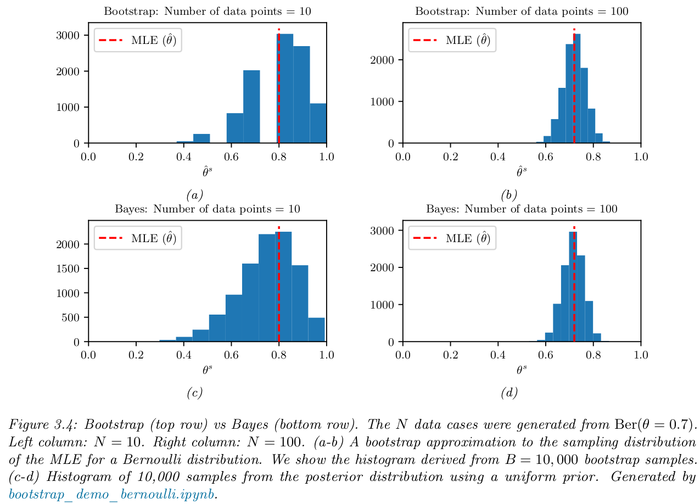
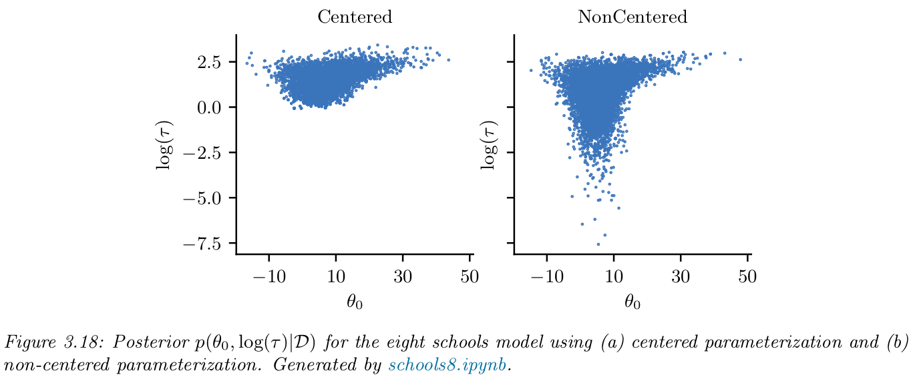

# 3 Statistics

## 3.1 Introduction
- Probability theory (Chapter 2) is all about modeling a distribution over observed data outcomes $\mathcal{D}$ (knowing the parameters $\boldsymbol{\theta}$) by computing $p(\mathcal{D}| \boldsymbol{\theta})$
- Statistics is the inverse problem. We want to compute $p(\boldsymbol{\theta}| \mathcal{D})$ (so we want to infer the parameters $\boldsymbol{\theta}$) given observations. There are two approaches:
    - **Frequentist**
    - **Bayesian** ($\leftarrow$ this is king)

## 3.2 Bayesian statistics
- Observed data $\mathcal{D}$ is known and fixed, parameters are unknown $\boldsymbol{\theta}$ (this is the opposite than frequentist approach (Sec3.3))
- We represent our beliefs about the parameters after seing data as a **posterior distribution** (eq.3.1): $p(\boldsymbol{\theta} \mid  \mathcal{D}) = \frac{p(\boldsymbol{\theta})p(\mathcal{D} \mid \boldsymbol{\theta})}{p(\mathcal{D})} = \frac{p(\boldsymbol{\theta})p(\mathcal{D} \mid \boldsymbol{\theta})}{\int p(\boldsymbol{\theta}^\prime)p(\mathcal{D} \mid \boldsymbol{\theta}^\prime)d\boldsymbol{\theta}^\prime}$
    - **posterior dist**:  $p(\boldsymbol{\theta} \mid  \mathcal{D})$
    - **prior dist**: $p(\boldsymbol{\theta})$
    - **likelihood**: $p(\mathcal{D} \mid \boldsymbol{\theta})$
    - **marginal dist**: $p(\mathcal{D})$
    
### 3.2.1 Tossing coins
- this is the 'atom' example of probabilities
- this whole section will use the example of Bayesian approach to coint tosses (Bernoulli) w/ beta prior
- We record the outcomes of observed data as $\mathcal{D}=\{y_n\in\{0,1\}:n=1:N \}$

#### 3.2.1.1 Likelihood
- In a simple coin toss, data is iid, and thus the **sufficient statistics** are $(N_1, N_0=N-N_1)$ in:
$p(\mathcal{D}\mid{\theta}) = \prod_n^N\theta^{y_n}(1-\theta)^{1-y_n}=\theta^{N_1}(1-\theta)^{N_0}$
    - $y_n$ is the outcome heads/tails at toss number $n$
    - *note that sufficient statistics $\neq\boldsymbol{\theta}$, sufficient stats refer to the quantities that capture enough info about the data to be able to estimate the parameters
- simple coint toss likelihood can also be computed using a *Binomial dist*: $p(\mathcal{D}\mid\boldsymbol{\theta})=\operatorname{Bin}(y \mid N, \theta)$

#### 3.2.1.2 Prior
- We can write an **uninformative prior** using a *uniform dist*, but the *beta dist* is more general: $p(\theta)=\operatorname{Beta}(\theta \mid \breve{\alpha},\breve{\beta}) \propto \theta^{\breve\alpha-1}(1-\theta)^{\breve\beta-1}$ 
    - $\breve{\alpha},\breve{\beta}$ are **hyperparameters** (params of the prior that determine our belief about $\boldsymbol{\theta}$), if $\breve{\alpha}=\breve{\beta}=1$ we recover the uniform dist


#### 3.2.1.3 Posterior
- $\text{posterior}\propto\text{likelihood}\times\text{prior}$
- continuing the example of a beta prior, we have a **congugate prior** because the posterior has the same functional form:
    $p(\theta \mid \mathcal{D}) \propto \theta^{N_1}(1-\theta)^{N_0} \theta^{\breve{\alpha}-1}(1-\theta)^{\breve{\beta}-1} \propto \operatorname{Beta}\left(\theta \mid \breve{\alpha}+N_1, \breve{\beta}+N_0\right)=\operatorname{Beta}(\theta \mid \widehat{\alpha}, \widehat{\beta})$

#### 3.2.1.4 Posterior mode (MAP estimate)
- In Bayesian statistics, MAP estimate is the mode of the posterior dist. It gives the most probable value of the parameter $\hat{\theta}_{\text{map}}=\arg\max_\theta p(\theta\mid\mathcal{D})=\arg\max_\theta\log p(\theta)+\arg\max_\theta\log p(\mathcal{D} \mid \theta)$
    - if prior is beta dist: $\hat{\theta}_{\text {map}}=\frac{\breve{\alpha}+N_1-1}{\breve{\alpha}+N_1-1+\breve{\beta}+N_0-1}$
    - if prior is uniform dist, we get the MLE: $\hat{\theta}_{\text {mle}}$, because $p(\theta)\propto 1\rightarrow \log p(\theta)\propto 0$
    - if sample size is low, we can use a stronger prior (more pronounced beta dist) **add-one smoothing**
    
#### 3.2.1.5 Posterior mean
- MAP is the posterior mode, which is equivalent to finding the mode of the dist, thus it is a weak representation of it (single point in the dist)
- The posterior mean is a more robust estimate, its an integral $\rightarrow \bar{\theta}=\int\theta p(\theta \mid \mathcal{D})d\theta$ 
    - if posterior is beta $\rightarrow \bar{\theta}=\mathbb{E}[\theta \mid \mathcal{D}]=\frac{\hat\alpha}{\hat{N}}$, where the *strength of the posterior* is $\hat{N}=\hat\alpha+\hat\beta$ (equivalent sample size)
        - the posterior is a convex combination of the MLE $\hat{\theta}_{\text {mle}}=N_1/ N$ and the prior mean $m=\breve\alpha/\breve{N}$:
        - $\bar\theta = \lambda m + (1-\lambda)\hat\theta_{\text{mle}}=\frac{\hat\alpha}{\hat{N}}$, where $\lambda=\breve{N} / \hat{N}$
        
#### 3.2.1.6 Posterior variance
- The uncertainity that comes with an estimation is given by the **Standard error**: $\operatorname{se}=\sqrt{\mathbb{V}(\theta \mid \mathcal{D})}$
- where the **variance** $\mathbb{V}$ is: 
    - for a beta posterior (we non-strictly showed that the posterior of a Bernoulli problem is a beta posterior dist) and when $N\gg \breve\alpha+\breve\beta$ simplifies to: $\mathbb{V}(\theta \mid \mathcal{D}) = \frac{\hat{\theta}_{\text {mle}}(1-\hat{\theta}_{\text {mle}})}{N}$
    - $\rightarrow$ $\operatorname{se}\approx \sqrt{\frac{\hat{\theta}_{\text {mle}}(1-\hat{\theta}_{\text {mle}})}{N}}$

#### 3.2.1.7 Credible intervals
- Since posterior dists can be incredibly complex functions, we usually work w/ single point estimates ie. mode, mean
- Typically we quantify the uncertainty of these using $100\times(1-\alpha)\%$ **credible intervals**: $\mathcal{C}_\alpha(\mathcal{D}) = \{\theta : F\}$ (predicate function $F$ determines how we define the members of the set in the interval)
    - **central interval** - interval bounded by $(\text{lower},\text{upper})=(l,u)$ that contains half of the weigth on each side $l=F^{-1}(\alpha/2), u=F^{-1}(1-\alpha/2)$,  such that $\mathcal{C}_\alpha(\mathcal{D}) = \{\theta : l\leq\theta\leq u\}$, where $F=\operatorname{cdf}$
    - **Higest probability density (HPD)** - unlike central interval, HPD can correct for highly probable values that can fall outside the interval by considering points above a threshold $p^*$ in the pdf: $1-\alpha=\int_{\mathcal{C}_\alpha}p(\theta \mid \mathcal{D})d\theta$, such that $\mathcal{C}_\alpha(\mathcal{D}) = \{\theta : p(\theta \mid \mathcal{D})\geq p^*\}$

#### 3.2.1.8 Posterior predictive distribution
- We want to predict a future observation, to achieve this we can
    - use Bayesian inference to obtain the posterior dist of the model parameters $p(\boldsymbol{\theta} \mid \mathcal{D})$ 
    - define the likelihood of observing a new data point $\boldsymbol{y}$ given $\boldsymbol{\theta}$: $p(\boldsymbol{y} \mid \boldsymbol{\theta})$
    - then we use the **posterior predictive dist**, which marginalizes OUT all the unkown params:     $p(\boldsymbol{y} \mid \mathcal{D})=\int \text{rv-dist}\times\text{param-post} \;d\boldsymbol{\theta} = \int p(\boldsymbol{y} \mid \boldsymbol{\theta})p(\boldsymbol{\theta} \mid \mathcal{D})d\boldsymbol{\theta}$
    
- `frequentist` where the most common approximation is **plug-in approx**: $p(\boldsymbol{y} \mid \mathcal{D})\approx p(\boldsymbol{y}\mid\boldsymbol{\hat\theta})$, basically plugging in a point estimate of params $\hat\theta=\delta(\mathcal{D})$ eg. MLE, MAP : 
    - $\delta(\theta-\hat\theta)\approx p(\boldsymbol{\theta} \mid \mathcal{D})$, which **shifts** $\rightarrow$ $p(\boldsymbol{y} \mid \mathcal{D})=\int p(\boldsymbol{y} \mid \boldsymbol{\theta})\delta(\theta-\hat\theta)d\boldsymbol{\theta} = p(\boldsymbol{y} \mid \boldsymbol{\hat\theta})$
    - A problem with plug-in approximation is overfitting and is weak against fat tails!
- `bayesian` Alternatively we can instead marginalize over all the values for each parameter $\boldsymbol{\theta}=(\ldots,\theta,\ldots)$, to compute the exact posterior predictive:
    - $p(y=1 \mid \mathcal{D})=\int_0^1p(y=1 \mid \theta)p(\theta \mid \mathcal{D})d\theta$
        - if beta posterior: $p(y=1 \mid \theta)=\int_0^1\theta\operatorname{Beta}(\theta \mid \hat\alpha, \hat\beta)d\theta = \hat\alpha / \hat{N}$
    - this Bayesian approach of marginalizing accounts for uncertainty
        - if prior is Beta then a.k.a. **Laplace's rule of succession**

#### 3.2.1.9 Marginal likelihood
- The **marginal likelihood** for a model $\mathcal{M}$ is: $p(\mathcal{D} \mid \mathcal{M})=\int p(\mathcal{D} \mid \boldsymbol{\theta},\mathcal{M})p(\boldsymbol{\theta} \mid \mathcal{M}) d\boldsymbol{\theta} $
    - We can ignore this, when performing inference of params, because is constant wrt $\boldsymbol{\theta}$
    - However, is extremly important for 
        - empirical Bayes, estimating hyperparams from data (Sec.3.7)
        - choosing models (Sec.3.8.1)
- Normally is hard to compute, except in the case of dealing w/ Bernoulli-beta model $\mathcal{M}$, where the marginal likelihood is proportional to the ratio of normalization constants for the posterior and prior: $p(\mathcal{D})=\frac{\operatorname{B}(\hat\alpha,\hat\beta)}{\operatorname{B}(\breve\alpha,\breve\beta)}$

### 3.2.2 Modeling more complex data
- In ML we can predict more complex phenomena than Bernoulli coin-tosses (Sec.3.2.1)
- We can predict outcomes $\boldsymbol{y}$ given input features $\boldsymbol{x}$ so now we have conditional prob dists of the form: $p(\boldsymbol{y}\mid \boldsymbol{x}, \boldsymbol{\theta})$ (basis of Generalized Linear models (Sec.15) and Neural Nets (Chapter.16) )
- A key quantity is the **posterior predictive dist**: $p(\boldsymbol{y}\mid \boldsymbol{x}, \mathcal{D}) = \int p(\boldsymbol{y}\mid \boldsymbol{x}, \boldsymbol{\theta}) p(\boldsymbol{\theta}\mid\mathcal{D}) d\boldsymbol{\theta}$
    - `Frequentist` approach $\rightarrow$ *plug-in approximation* + MLE / MAP, has the downside that is sensitive to overfitting and fat-tails. Because it estimates a constant uncertainty ($\hat\sigma$) for all predictions
        - The nature of uncertainty can be decomposed in **aleatoric/stochastic** (intrinsic, can't be reduced) & **epistemic** uncertainty (can be reduced)
    - Heart of `Bayesian` approach is $\rightarrow$ integrating/marginalizing OUT unkown parameters, effectively computing weighted averages of predictions and reducing uncertainty (variable uncertainty as opposed to the frequentist approach)
        - Bayes approach accounts for *epistemic uncertainty*, useful for Bayesian lin reg (Sec.15.2), optimization (Sec.6.6),risk-sensitive decision making (Sec.34.1.3) & active learning (Sec.34.7) 
        - moreover Bayesian methods are great for non-linear models such as NNs (Sec.17.1) & Generative models (Part-IV)

### 3.3.3 Selecting the prior
- A challenge w/ Bayes approach is that it requires us to choose the prior $\rightarrow$ can be difficult in large models, eg. NNs
- In later sections we'll discuss prior selection
    - *conjugate priors* (Sec.3.4)
    - *unninformative priors* (Sec.3.5)
    - *hierarchical priors* (Sec.3.6)
    - *empirical priors* (Sec.3.7)

### 3.2.4 Computational issues
- Computing posteriors / predictives is expensive in Bayesian approach. Full discussion about this in (Part-II) and a good historical manuscript is [[MFR20](https://arxiv.org/pdf/2004.06425)]

### 3.2.5 Exchangeability and de Finetti's Theorem
- De Finetti's Theorem is a result of the philosophical question: where do priors come from? Priors $p(\boldsymbol{\theta})$ are abstract, non-directly measurable quantities. 
    - De Finetti formalized the concept of **Infinetly exchangeable** sequence of rand vars (which is more general than iid): the joint prob of a sequence of rvs is invariant under permutation of indices
    - *Theorem 3.2.1 (de Finetti’s theorem).* A sequence of iid rvs $(\boldsymbol{x}_1, \ldots, \boldsymbol{x}_n)$ is infinitely exchangeable iff, for all $n$ $\Rightarrow$ a param $\boldsymbol{\theta}$, a likelihood $p(\boldsymbol{x}_i\mid\boldsymbol{\theta})$ & a prior $p(\boldsymbol{\theta})$ EXISTS: 
        - $p(\boldsymbol{x}_1, \ldots, \boldsymbol{x}_n) = \int \prod_{i=1}^n p(\boldsymbol{x}_i\mid\boldsymbol{\theta})p(\boldsymbol{\theta})d\boldsymbol{\theta}$


## 3.3 Frequentist statistics
- Bayes stats treats  params as rvs, and whereas its true that we can't observe $\theta$, Bayes gives the maleability to decompose probs via de Finetti's theorem $\rightarrow$ forcing to use a prior
- The frequentist approach, on the other hand, builds up from the ideas of not needing priors nor treating params as rvs
    - the basic idea (Sec.3.3.1) is to represent uncertainty by calculating how an estimate (can be a param or predicted feature) would change if the sampled data changes $\rightarrow$ the notion of samples and trials emerges from frequentist stats
        - `frequentist` views probs as variation accross repeated trials, this is the foundation for modeling uncertainty
        - `bayes` views probs in terms of information rather than trials
        - there are a few concepts from frequetist stats that are cross-paradigm-useful like: cross-validation, model checking & conformal prediction

### 3.3.1 Sampling distributions
- In frequestist stats the uncerainty is not represented by a posterior dist of a rv, but rather by the **sampling dist** of an estimator
    - the dist of $\boldsymbol{\hat\theta}$ viewed as a rv can be obtained by applying the estimator multiple times to many $S $ samples $\tilde{\mathcal{D}}^{(s)}\sim\boldsymbol{\theta}^\ast$ (generated by some true model $p(\boldsymbol{x}\mid\boldsymbol{\theta}^\ast)$ and each of size $N$)
    - then we get a set of estimates $\{\hat{\boldsymbol{\theta}}(\mathcal{D}^{(s)})\}$ that in the limmit of $S\rightarrow\infty$: $p\left(\hat{\Theta}(\tilde{\mathcal{D}})=\boldsymbol{\theta}\mid\tilde{\mathcal{D}}\sim\boldsymbol{\theta}^\ast\right) \approx \frac{1}{S}\sum_{s=1}^S\delta\left(\boldsymbol{\theta} - \Theta\left(\tilde{\mathcal{D}}^{(s)}\right) \right)$
    - this can be approximated by *Monte Carlo* (Sec.3.3.2) and rarely computed analytically (Sec.3.3.3)

### 3.3.2 Bootstrap approximation of the sampling distribution
- When data is small or the estimator is a complex function of the data $\rightarrow$ Monte Carlo method known as **Bootstrap** is very powerful [[ET93](https://books.google.com/books?hl=en&lr=&id=gLlpIUxRntoC&oi=fnd&pg=PR14&dq=an+introduction+to+the+bootstrap&ots=AaCyV2LeD2&sig=CjNPLqpdtSj-f96GU8thaG8B7kg)]
    - The premise is simple: if we knew the true params $\boldsymbol{\theta}^\ast$ we could generate $S$ "fake" samples (each of size $N$) that are observables $\tilde{\mathcal{D}}^{(s)} = \left\{ \boldsymbol{x}_n\sim p(\boldsymbol{x}_n\mid\boldsymbol{\theta}^\ast):n=1:N\right\}$
    - then compute each sample estimates $\hat{\boldsymbol\theta}^{s} = \hat{\Theta}\left(\tilde{\mathcal{D}}^{(s)}\right)$ and then use the empirical estimate of this dist
    
- **parameteric bootstrap** is a *plug-in approx* (Sec.3.2.1.8), proposes generating samples from $\hat{\boldsymbol{\theta}}=\hat{\Theta}\left(\mathcal{D} \right)$ instead of $\boldsymbol{\theta}^\ast$ in (eq.3.37) ie. we use $\tilde{\mathcal{D}}^{(s)}=\left\{\boldsymbol{x}_n\sim p(\boldsymbol{x}_n\mid\hat{\boldsymbol{\theta}}):n=1:N\right\}$ this is a plug-in approx to the sampling dist
- Because the generating model $p(\boldsymbol{x}\mid\boldsymbol{\theta})$ for an initial $\hat{\boldsymbol{\theta}}$ is often not available, we can use **non-parametric bootstrap** $\rightarrow$ *re-sampling w/ replacement* 
    - fact: the number of unique datapoints in a bootstrap sample is $(1-(1-1/N)^N)\sim 1 - e^{-1}\approx 0.632$, for large $N$
- From Fig.3.4 how is parametric boostrap estimate $\hat{\boldsymbol{\theta}}^s = \delta\left(\mathcal{D} \right)$ (a-b) different from posterior sampling $\boldsymbol{\theta}^s\sim p(\cdot \mid \mathcal{D})$ (c-d)? Ans. very different conceptually but not so different if frequentist estimator is MLE and bayes prior is weak
    



### 3.3.3 Assymptotic normality of the sampling distribution of the MLE
- the most common estimator is MLE. When sample size is large then the MLE sampling dist becomes Normal 
- *Theorem 3.3.1* under certain conditions:
    $\sqrt{N} (\hat{\boldsymbol{\theta}}-\boldsymbol{\theta}^\ast) \rightarrow \mathcal{N}(\mathbf{0}, \mathbf{F}(\boldsymbol{\theta}^\ast)^{-1})$, where $\mathbf{F}$ is the *Fisher information matrix* (Sec.3.3.4.1)

### 3.3.4 Fisher Information Matrix (FIM)
- The FIM is related to the curvature of the log-likelihood. It is crucial in freq stats for characterizing the sampling dist in MLE (Sec.3.3.3)
- Also useful in Bayes stats: used to define *Jeffrey's unninformative priors* (Sec.3.5.2) & optimization techniques ie gradient descent, procedure $\ldots$ (Sec.6.4)

#### 3.3.4.1 FIM Definition
- The **score function** measures the amount of information a rv $\boldsymbol{x}$ carries about a param $\theta$ that models $\boldsymbol{x}$. It's the grad of the log-likelihood (eq.3.39): $\boldsymbol{s}(\boldsymbol{\theta})=\nabla\log p(\boldsymbol{x}\mid \boldsymbol{\theta})$
- FIM is the covariance of the score func (eq.3.40): $\mathbf{F}(\boldsymbol{\theta})=\mathbb{E}_{\boldsymbol{x}\sim p(\boldsymbol{x}\mid\boldsymbol{\theta})}\left[\boldsymbol{s}\boldsymbol{s}^\top \right]$

#### 3.3.4.2 Equivalence between FIM and the Hessian of the NLL
- FIM equals the expected Hessian of the negative log-likelihood NLL ($\operatorname{NLL}(\boldsymbol{\theta})=-\log p(\mathcal{D}\mid\boldsymbol{\theta})$)
    - the Hessian (square mat of 2nd ord partial derivatives) describes the curvature of a multivariate func ie. likelihood $\rightarrow$ FIM tells us how well the likelihood func can identify the optimal params
    - Proof of this uses *Theorem 3.3.2* & *Lemma 3.3.1*, which results in (eq.3.53): $\mathbb{E}_{p(\mathcal{D} \mid \boldsymbol{\theta})}\left[\left.\mathbf{H}(\mathcal{D})\right|_{\boldsymbol{\theta}}\right]=N \mathbf{F}(\boldsymbol{\theta})$

#### 3.3.4.3 Example: FIM for the Binomial
- We arrive to the FIM for the eg. single-sample ($N=1$) Binomial $x\sim\operatorname{Bin}(n,\theta)$ using:
    - log-likelihood: $l(\theta\mid x)=x\log(\theta) + (n-x)\log(1-\theta)$
    - score func: $\nabla_\theta l(\theta\mid x) = \frac{x}{\theta}-\frac{n-x}{1-\theta}$
    - Hessian: $\nabla_\theta^2 l(\theta\mid x) = -\frac{x}{\theta^2}-\frac{n-x}{(1-\theta)^2}$
    - FIM: $\mathbb{E}[\mathbf{H}(-l)] = \frac{n}{\theta(1-\theta)}$

#### 3.3.4.4 Example: FIM for the univariate Gaussian
- FIM for eg. the univariate Gaussian $p(x\mid\boldsymbol{\theta}) = \mathcal{N}(x\mid\mu,\sigma^2)$ w/ log-likelihood $l(\boldsymbol{\theta})$ is:


\begin{align*}
\mathbf{F}(\boldsymbol{\theta})=\left(\begin{array}{cc} 
\mathbb{E}\left[-\frac{\partial^2 l}{\partial\mu^2}\right] & \mathbb{E}\left[-\frac{\partial^2 l}{\partial\mu\partial(\sigma^2)}\right] \\
\mathbb{E}\left[-\frac{\partial^2 l}{\partial\mu\partial(\sigma^2)}\right] & \mathbb{E}\left[-\frac{\partial^2 l}{\partial(\sigma^2)^2}\right]
\end{array}\right)=\left(\begin{array}{cc}
\frac{1}{\sigma^2} & 0 \\
0 & \frac{1}{2 \sigma^4}
\end{array}\right)
\end{align*}


#### 3.3.4.5 Example: FIM for Logistic Regression
- By the same token as before, for eg. the $l_2$-regularized binary log reg w/ negative log joint $\mathcal{E}(\boldsymbol{w})=-\log[p(\boldsymbol{y}\mid\mathbf{X},\boldsymbol{w}) p(\boldsymbol{w}\mid\lambda)]$
    - FIM: $\mathbf{F}(\boldsymbol{w}) = \mathbb{E}\left[\nabla^2\mathcal{E}(\boldsymbol{w}) \right] = \mathbf{X}^\top\mathbf{\Lambda}\mathbf{X}+\lambda\mathbf{I}$, where $\mathbf{\Lambda}$ is an $N\times N$ mat: $\Lambda_{nn}=\sigma(\boldsymbol{w}^\top\boldsymbol{x}_n)(1-\sigma(\boldsymbol{w}^\top\boldsymbol{x}_n))$

#### 3.3.4.6 Example: FIM for the Exponential family
- FIM for expo fam eg. in its **natural/canonical parameterization** version ($\boldsymbol{\eta}$). Recall from:
    - (eq.2.216) in (Sec.2.4.3) that the gradient of the *log-partition func* is the expected *sufficient statistics* $\nabla_{\boldsymbol{\eta}}A(\boldsymbol{\eta}) = \mathbb{E}[\mathcal{T}(\boldsymbol{x})] = \boldsymbol{m}$ 
    - and (eq.2.247) that the log-likelihood is suff stats minus its expected val: $\nabla_{\boldsymbol{\eta}}\log p(\boldsymbol{x}\mid\boldsymbol{\eta}) = \mathcal{T}(\boldsymbol{x}) - \mathbb{E}[\mathcal{T}(\boldsymbol{x})]$
    - then the FIM is: $\mathbf{F}_{\boldsymbol{\eta}}=\operatorname{Cov}[\mathcal{T}(\boldsymbol{x})]$
- FIM in its **moment parameterization** version: $\mathbf{F}_{\boldsymbol{m}}=\mathbf{F}_{\boldsymbol{\eta}}^{-1}=\mathrm{Cov}[\mathcal{T}(\boldsymbol{x})]^{-1}$

### 3.3.5 Counterintuitive properties of frequentist statistics
- Frequentist stats carries pathological properties, so its strange that this is the most taught paradigm in academia. We'll explore these limitations in the following sub-sections

#### 3.3.5.1 Confidence intervals
- In the frequentist approach we can access to variability / uncertainty because of an artificial action: sampling.
In summary 
    - Confidence intervals are an example of a missleading and inconsistent interpretation of uncertainty
    - Bayes approach doesn't deal w/ this because it relies in updating our knowledge of the world

#### 3.3.5.2 p-values
- The **p-value** *hypothesis testing* is a procedure that defines if we can accept the *null-hypothesis* $H_0$ according to if an observed test statistic $t(\mathcal{D})$  is likely under the sampling dist of the null model
    - if $H_0$ is true, then this test statistic would probably not occur. This statistic did occur.
Therefore $H_0$ is probably false
    - This reasoning is incomplete and also  leads to inconsistencies


#### 3.3.5.3 Discussion
- Users of statistics want to know the probability (after seeing the data) that a hypothesis is true, or the probability that the param $\theta$ is in a given interval, and yet frequentist can't offer this
    - frequentists assume fixed parameters $\boldsymbol{\theta}$ given a model, which are then evaluated w/ hypothesis tests. This rigid approach forces to induce fixed uncertainty (using sampling) and use conf ints that have the limitation of ruling out whatever doesn't fit our model.
    - Bayes, instead, is a calibrated approach. We update our opinions of the world given new observed data, having $\boldsymbol{\theta}$ as a quantity w/ capabilities of updating
    - Great readings on this topic: https://bit.ly/3Rbd4lo and https://bit.ly/3j8miSR

### 3.3.6 Why isn't everyone a Bayesian?
- Hard to argue in favor of frequentists, a great summary is this write-up: [[Erf86](https://www.tandfonline.com/doi/abs/10.1080/00031305.1986.10475342)]
- In the past everyone was a Bayesian (eg. Laplace, Gauss) until recent academic program. However, it is reclaiming dominance thanks to ML

## 3.4 Conjugate priors

- *conjugate priors* (a special form of priors) simplify the computaiton of Bayesian posteriors via closed computation of functional family $\mathcal{F}$. This is formally written as: 
    - the prior $p(\boldsymbol{\theta})$ in the parameterized family $\mathcal{F}$ is **conjugate prior** of the likelihood $p(\mathcal{D}\mid{\theta})$ if the posterior is in the same parameterized family $\mathcal{F}$ (eg. Sec.3.2.1.3) $\rightarrow$ So $\mathcal{F}$ is closed under Bayesian updating
    - the exponential family also allows closed $\mathcal{F}$ computation

### 3.4.1 The Binomial model
- One of the simpliest models is the beta-binomial model, we've seen it in Sec.3.2.1

### 3.4.2 The multinomial model
- Generalizes the Binomial model to $C$ number of categories and $N$ number of trials. Also, let the rv $y\sim\operatorname{Cat}(\boldsymbol{\theta})$
    - likelihood (one prod for trials and another for categorical dists): $p(\mathcal{D}\mid\boldsymbol{\theta})=\prod^N \operatorname{Cat}(y_n\mid\boldsymbol{\theta})=\prod^N\prod^C\theta_c^{\mathbb{I}(y_n=c)}=\prod^C\theta_c^{N_C}$
    - this generalized to the **multinomial dist** by accounting for unique counts using the binomial term: $p(\boldsymbol{y} \mid N, \boldsymbol{\theta})=\left(\begin{array}{c} N \\ N_1 \ldots N_C \end{array}\right) \prod^C \theta_c^{N_c}$
    - *conjugate prior* for a cat dist is the Dirichlet dist: $p(\boldsymbol{\theta})=\operatorname{Dir}(\boldsymbol{\theta},\breve{\boldsymbol{\alpha}})$
    - *Dirichlet posterior* is: $p(\boldsymbol{\theta}\mid\mathcal{D})\propto \operatorname{Dir}(\boldsymbol{\theta},\hat{\boldsymbol{\alpha}})$, where as any other conjugate prior it has the same functional form w/ change of variables $\hat{\alpha}_k=\breve{\alpha}+N_k$ ($k$-th categorie of $C$)
    - some cool features:
        - mode is: $\hat{\theta}_k=\frac{N_k+\breve{\alpha}_k-1}{\sum^K N_k+\hat{\alpha}-1}$, from which we recover the MLE and add-one smoothing w/ , $\breve{\alpha}=1,2$ respectively
        - the *marginal likelihood* can be written in terms of beta and gamma dists: $p(\mathcal{D})=\frac{\operatorname{B}(\mathbf{N}+\boldsymbol{\alpha})}{\operatorname{B}(\boldsymbol{\alpha})}=\frac{\Gamma(\sum_k\alpha_k)}{\Gamma(N+\sum_k\alpha_k)}\prod_k\frac{\Gamma(N_k+\alpha_k)}{\Gamma(\alpha_k)}$
        
### 3.4.3 The univariate Gaussian distribution
- There's different cojugate priors depending on which params are known ie: only $\mu$ is unknown, only $\sigma^2$ is unknown and both $\boldsymbol{\theta}=(\mu, \sigma^2)$ are not knwon. We'll explore each case in the following sections

#### 3.4.3.1 Posterior of $\mu$ given $\sigma^2$
- likelihood is Gaussian: $p(\mathcal{D}\mid\mu)\propto \exp \left( -\frac{1}{2\sigma^2} \sum^N_{n=1}(y_n-\mu)^2 \right)$
- conjugate rior is Gaussian: $p(\mu)=\mathcal{N}(\mu\mid \breve{m},\breve{\tau}^2)$
- then posterior is also Gaussian (apply Bayes' rule): $p(\mu\mid\mathcal{D},\sigma^2)=\mathcal{N}(\mu\mid \hat{m},\hat{\tau}^2)$
    - see eq.3.98-3.107 for more details and its precision version $\lambda=1/\sigma^2, \breve{\lambda}=1/\breve{\tau}^2$

#### 3.4.3.2 Posterior of $\sigma^2$ given $\mu$
- Likelihood is Gaussian: $p(\mathcal{D}\mid\sigma^2) \propto (\sigma^2)^{-N/2}\exp\left( -\frac{1}{2\sigma^2} \sum^N_{n=1}(y_n-\mu)^2\right)$
- Regular parameterization 
    - conjugate prior is the **Inverse Gamma** (IG) dist: $\operatorname{IG}(\sigma^2\mid\breve{a}, \breve{b}) = \frac{\breve{b}^{\breve{a}}}{\Gamma(\breve{a})}(\sigma^2)^{-(\breve{a}+1)}\exp(-\breve{b}/\sigma^2)$
    - posterior is also IG: $p(\sigma^2\mid\mu,\mathcal{D})=\operatorname{IG}(\sigma^2\mid\hat{a},\hat{b})$

- one annoying aspect of the previous parameterization is that the strength of the prior is embedded in both $\breve{a}$ & $\breve{b}$ $\rightarrow$ in Bayesian stats an alternative parameterization uses **inverse chi-squared dist** (IX): 
    - $\chi^{-2}(\sigma^2\mid\breve{\nu},\breve{\tau}^2)=\operatorname{IG}(\sigma^2\mid\frac{\breve{\nu}}{2}, \frac{\breve{\nu}\breve{\tau}^2}{2})$
    - then posterior is: $p(\sigma^2\mid\mathcal{D},\mu)=\chi^{-2}(\sigma^2\mid\hat{\nu},\hat{\tau}^2)$
    - now the strength of the prior is controlled by the **degrees of freedom** (dof) $\hat{\nu}$ and $\breve{\tau}^2$ encodes the prior mean
    
#### 3.4.3.3 Posterior of both $\mu$ and $\sigma^2$: conjugate prior
- Likelihood is Gaussian as in Sec.3.4.3.2
- Regular parameterization
    - conjugate prior is the **Normal Inverse Gamma (NIG)**: $\operatorname{NIG}(\mu,\sigma\mid\breve{m},\breve{\kappa},\breve{a},\breve{b})=\mathcal{N}(\mu\mid\breve{m},\sigma^2/\breve{\kappa})\operatorname{IG}(\sigma^2\mid\breve{a},\breve{b})$
- **Normal Inverse $\chi^2$ (NIX)** parameterization: 
    - NIX prior param is: $NI\chi^2(\mu,\sigma^2\mid\breve{m},\breve{\kappa},\breve{\nu},\breve{\tau}^2)=\mathcal{N}(\mu\mid\breve{m},\sigma^2/\breve{\kappa})\chi^{-2}(\sigma^2,\breve{\nu},\breve{\tau}^2)$
    - posterior: $p(\mu,\sigma^2\mid\mathcal{D})=NI\chi^2(\hat{m},\hat{\kappa},\hat{\nu},\hat{\tau}^2)$
        - eq.3.120-3.124 represent combinations of params and allow a neat interpretation
        - eq.3.125-3.126 give the posterior marginals for $\sigma^2$ and $\mu$, respectively:
        - $p(\sigma^2\mid\mathcal{D})\int p(\mu,\sigma^2\mid\mathcal{D})d\mu=\chi^{-2}(\sigma^2\mid\hat{\nu}, \hat{\tau}^2)$, [w/ post mean $\mathbb{E}[\sigma^2\mid\mathcal{D}]=\frac{\hat{\nu}}{\hat{\nu}-2}\hat{\tau}^2$]
        - $p(\mu,\mathcal{D})=\int p(\mu,\sigma^2\mid\mathcal{D})d\sigma^2=\mathcal{T}(\mu\mid\hat{m},\hat{\tau}^2/\hat{\kappa},\hat{\nu})$, [w/ post mean $\mathbb{E}[\mu,\mathcal{D}]=\hat{m}$]

#### 3.4.3.3 Posterior of both $\mu$ and $\sigma^2$: uninformative prior
- We use a non-informative prior if we have no reasons to start w/ a strong prior, more details in Sec.3.5
- In summary the approach is to use *Jeffrey's prior* to identify a location $\mu$ and a scale param $\sigma^2$. then simmulate the previous using NIX conjugate prior 

### 3.4.4 Multivariate Gaussian
- Refer to the book for full equations, these are long eqs w/ many matrix manipulations. Here We'll write the minimal expressions
    - recall that Chap.3. Statistics is all about obtaining posteriors ie. $p(\boldsymbol{\mu}, \boldsymbol{\Sigma}\mid\mathcal{D})$

#### 3.4.4.1 Posterior of $\boldsymbol{\mu}$ given $\boldsymbol{\Sigma}$
- likelihood (can ignore the proportional factor): $p(\mathcal{D}\mid\boldsymbol{\mu})=\mathcal{N}(\boldsymbol{\bar{y}}\mid\boldsymbol{\mu},\boldsymbol{\Sigma}/N)$
- conjugate (for simplicity) prior is Gaussian: $p(\boldsymbol{\mu})=\mathcal{N}(\boldsymbol{\mu}\mid\boldsymbol{\breve{m}}, \mathbf{\breve{V}})$
- posterior is also Gaussian: $p(\boldsymbol{\mu}\mid\mathcal{D}, \boldsymbol{\Sigma})=\mathcal{N}(\boldsymbol{\mu}\mid\boldsymbol{\hat{m}}, \mathbf{\hat{V}})$

#### 3.4.4.2 Posterior of $\boldsymbol{\Sigma}$ given $\boldsymbol{\mu}$
- likelihood is MVG: $p(\mathcal{D}\mid\boldsymbol{\mu},\mathbf{\Sigma}) \propto |\boldsymbol{\Sigma}|^{-N/2}\exp\left(-\frac{1}{2} \operatorname{tr}(\mathbf{S}_\mu\boldsymbol{\Sigma}^{-1})\right)$, where $\mathbf{S}_\mu$ is a scatter matrix around $\mu$
- conjugate prior is **Inverse Wishart (IW)** dist: $\operatorname{IW}(\mathbf{\Sigma}\mid\boldsymbol{\breve{\Psi}}, \breve{\nu}) \propto |\boldsymbol{\Sigma}|^{-(\breve{\nu}+D+1)/2}\exp\left(-\frac{1}{2} \operatorname{tr}(\boldsymbol{\breve{\Psi}}\boldsymbol{\Sigma}^{-1})\right)$, where $\breve{\nu}>D-1$ is dof, $\mathbf{\breve{\Psi}}$ is a symmetric pd mat, acts as a prior scatter mat and $N_0=\breve{\nu}+D+1$ controls the strength of the prior
- posterior is also an IW: $p(\boldsymbol{\Sigma} \mid \mathcal{D}, \boldsymbol{\mu})\propto|\boldsymbol{\Sigma}|^{-\frac{N}{2}} \exp \left(-\frac{1}{2} \operatorname{tr}\left(\boldsymbol{\Sigma}^{-1} \mathbf{S}_\mu\right)\right)|\boldsymbol{\Sigma}|^{-(\breve{\nu}+D+1) / 2}$

#### 3.4.4.3 Posterior of both $\boldsymbol{\mu}$ and $\boldsymbol{\Sigma}$
- likelihood is MVN (can be written as in Sec.2.3.1.1, but we'll use a modified version): $p(\mathcal{D} \mid \boldsymbol{\mu}, \boldsymbol{\Sigma}) \propto|\boldsymbol{\Sigma}|^{-\frac{N}{2}}\exp\left(-\frac{N}{2} (\boldsymbol{\mu}-\bar{\boldsymbol{y}})^{\top} \boldsymbol{\Sigma}^{-1}(\boldsymbol{\mu}-\bar{\boldsymbol{y}})\right) \exp \left(-\frac{1}{2} \operatorname{tr}\left(\boldsymbol{\Sigma}^{-1} \mathbf{S}\right)\right)$, where $\mathbf{S}=\mathbf{S}_{\boldsymbol{\bar{y}}}=\mathbf{Y}^\top \mathbf{C}_N \mathbf{Y}$ is a scatter matrix and $\mathbf{C}_N$ is a centering matrix
-prior:
    - following naive intuition would lead us to use the prior: $p(\boldsymbol{\mu},\boldsymbol{\Sigma})=\mathcal{N}(\boldsymbol{\mu}\mid\boldsymbol{\breve{m}}, \mathbf{\breve{V}})\operatorname{IW}(\boldsymbol{\Sigma}\mid\boldsymbol{\breve{\Psi}}, \breve{\nu})$, BUT is not a conjugate prior but rather a **conditionally conjugate** (because $\boldsymbol{\mu}, \boldsymbol{\Sigma}$ appear in a non-factorizable way in the likelihood)
    - thus we use change of variables and arrive to an **Normal-Inverse-Wishart (NIW)** dist which is our conjugate prior: $\operatorname{NIW}(\boldsymbol{\mu},\boldsymbol{\Sigma}\mid\boldsymbol{\breve{m}},\breve{\kappa},\breve{\nu},\boldsymbol{\breve{\Psi}})=\mathcal{N}(\boldsymbol{\mu}\mid\boldsymbol{\breve{m}},\boldsymbol{\Sigma}/\breve{\kappa})\operatorname{IW}(\boldsymbol{\Sigma}\mid\boldsymbol{\breve{\Psi}},\breve{\nu})$, 
        - where $\boldsymbol{\breve{m}}$ is our prior mean for $\boldsymbol{\mu}$, and $\breve{\kappa}$ is how strongly we strongly we believe this prior; $\boldsymbol{\breve{\Psi}}$ is (proportional to) our prior mean for $\boldsymbol{\Sigma}$, and $\breve{\nu}$ is how strongly we believe this prior
- posterior is also a NIW (after long chang vars & matrix manipulations): $p(\boldsymbol{\mu},\boldsymbol{\Sigma}\mid\mathcal{D})=\operatorname{NIW}(\boldsymbol{\mu},\boldsymbol{\Sigma}\mid\boldsymbol{\hat{m}},\hat{\kappa},\hat{\nu},\boldsymbol{\hat{\Psi}})=\mathcal{N}(\boldsymbol{\mu}\mid\boldsymbol{\hat{m}},\boldsymbol{\Sigma}/\hat{\kappa})\operatorname{IW}(\boldsymbol{\Sigma}\mid\boldsymbol{\hat{\Psi}},\hat{\nu})$ 
    - $\boldsymbol{\hat{\mu}}=\frac{\breve{\kappa}}{\breve{\kappa}+N}\boldsymbol{\breve{\mu}}+\frac{N}{\breve{\kappa}+N}\boldsymbol{\bar{y}}$
    - $\boldsymbol{\hat{\Psi}}=\boldsymbol{\breve{\Psi}}+\mathbf{Y}^\top\mathbf{Y}+\breve{\kappa}\boldsymbol{\breve{m}}\boldsymbol{\breve{m}}^\top-\hat{\kappa}\boldsymbol{\hat{m}}\boldsymbol{\hat{m}}^\top$, with a (re-writen) scatter matrix for a rv $\mathcal{D}\rightarrow\mathbf{Y}$: $\mathbf{S}=\mathbf{Y}^\top\mathbf{Y}-N\boldsymbol{\bar{y}}\boldsymbol{\bar{y}}^\top$
    - the interpretation is intuitive: the posterior mean $\boldsymbol{\hat{m}}$ is a convex combination of the prior mean and the MLE; the posterior scatter matrix $\boldsymbol{\hat{\Psi}}$ is the prior scatter matrix $\boldsymbol{\breve{\Psi}}$ plus the empirical scatter matrix $\mathbf{S}$ plus an extra term due to the uncertainty in the mean (which creates its own virtual scatter matrix eq.3.171); the posterior confidence factors $\hat{\kappa}$ and $\hat{\nu}$ are both incremented by the size of the data we condition on
- posterior have different flavors (MLE, MAP, marginals) and uses (eg. predicting rvs):
    - *posterior marginals*: from the last NIW posterior, we can compute the marginals for $\boldsymbol{\mu}$ and $\boldsymbol{\Sigma}$
        - $p(\boldsymbol{\Sigma}\mid\mathcal{D})=\int p(\boldsymbol{\mu},\boldsymbol{\Sigma}\mid\mathcal{D})d\boldsymbol{\mu}=\operatorname{IW}(\boldsymbol{\Sigma}\mid\boldsymbol{\hat{\Psi}},\hat{\nu})$
        - $p(\boldsymbol{\mu}\mid\mathcal{D})=\int p(\boldsymbol{\mu},\boldsymbol{\Sigma}\mid\mathcal{D})d\boldsymbol{\Sigma}=\mathcal{T}(\boldsymbol{\mu}\mid\boldsymbol{\hat{\mu}},\frac{\boldsymbol{\hat{\Psi}}}{\hat{\kappa}\hat{\nu}^\prime},\hat{\nu}^\prime)$, where $\hat{\nu}^\prime=\hat{\nu}-D+1$
    - *posterior mode*: the MAP of $\boldsymbol{\mu}$ and $\boldsymbol{\Sigma}$ is the mode of NIW (lets say that our observations are rvs $\mathbf{Y}$): $p(\boldsymbol{\mu},\boldsymbol{\Sigma}\mid\mathbf{Y})=\operatorname{NIW}(\boldsymbol{\mu}=\boldsymbol{\hat{\mu}},\boldsymbol{\Sigma}\mid\boldsymbol{\hat{m}}=\boldsymbol{\hat{\mu}},\hat{\kappa},\hat{\nu},\boldsymbol{\hat{\Psi}})$, where $\boldsymbol{\hat{\mu}}$ is identical as the last NIW posterior (convex comb) and we can factorize $\boldsymbol{\Sigma}$ and obtain its estimate directly from the IW term: $\boldsymbol{\hat{\Sigma}}=\frac{1}{\hat{\nu}+D+2}\boldsymbol{\hat{\Psi}}$
    - *posterior predictive*: following Sec.3.2.1.8 idea's $p(\boldsymbol{y} \mid \mathcal{D})=\int \text{rv-dist}\times\text{bayes-post} \;d\boldsymbol{\theta}$ ; but now rv-dist is MVN: $p(\boldsymbol{y}\mid\mathcal{D})=\int\mathcal{N}(\boldsymbol{x}\mid\boldsymbol{\mu},\boldsymbol{\Sigma})\operatorname{NIW}(\boldsymbol{\mu},\boldsymbol{\Sigma}\mid\boldsymbol{\hat{m}},\hat{\kappa},\hat{\nu},\boldsymbol{\hat{\Psi}})d\boldsymbol{\mu}d\boldsymbol{\Sigma}=\mathcal{T}\left(\boldsymbol{y}\mid\boldsymbol{\hat{m}},\frac{\boldsymbol{\hat{\Psi}}(\hat{\kappa}+1)}{\hat{\kappa}\hat{\nu}^\prime}, \hat{\nu}^\prime \right)$
    

### 3.4.5 The Exponential Family
- In Sec.3.4.4 we've seen how conjugate priors simplify the computation of posteriors because they have the same functional form ($\rightarrow \mathcal{F}$ is **closed form** ie up to chang of vars). 
- The only family that guarantees its likelihoods to have fixed-sized sufficient stats [$\rightarrow$ $p(\mathcal{D}\mid\boldsymbol{\theta})=p(\boldsymbol{s}(\mathcal{D})\mid\boldsymbol{\theta})$] is the *Exponential Family* (w/ few exceptions. eg Unif likelihood - Pareto prior & posterior)

#### 3.4.5.1 Likelihood
- likelihood: $p(\mathcal{D}\mid\boldsymbol{\eta})=h(\mathcal{D})\exp\left(\boldsymbol{\eta}^\top\boldsymbol{s}(\mathcal{D})-N A(\boldsymbol{\eta})\right)$, where $\boldsymbol{s}(\mathcal{D})=\sum^N\boldsymbol{s}(\boldsymbol{x}_n)$ and $h(\mathcal{D})=\prod^Nh(\boldsymbol{x}_n)$

#### 3.4.5.2 Prior
- prior: $p(\boldsymbol{\eta}\mid\boldsymbol{\breve{\tau}},\breve{\nu})=\frac{1}{Z(\boldsymbol{\breve{\tau}},\breve{\nu})}\exp\left(\boldsymbol{\breve{\tau}}^\top\boldsymbol{\eta}-\breve{\nu}A(\boldsymbol{\eta})\right)$, where $\breve{\nu}$ is the strength of prior, $\boldsymbol{\breve{\tau}}/\breve{\nu}$ is prior mean and part func $Z$ is normalization factor

#### 3.4.5.3 Posterior
- posterior: $p(\boldsymbol{\eta}\mid\mathcal{D})=\frac{p(\mathcal{D}\mid\boldsymbol{\eta})p(\boldsymbol{\eta})}{p(\mathcal{D})}=\frac{1}{Z(\boldsymbol{\hat{\tau}},\hat{\nu})}\exp\left(\boldsymbol{\hat{\tau}}^\top\boldsymbol{\eta}-\hat{\nu}A(\boldsymbol{\eta})\right)$
    - $\boldsymbol{\hat{\tau}}=\boldsymbol{\breve{\tau}}+\boldsymbol{s}(\mathcal{D})$
    - $\hat{\nu}=\breve{\nu}+N$
    - $Z(\boldsymbol{\hat{\tau}},\hat{\nu})=\frac{Z(\boldsymbol{\breve{\tau}},\breve{\nu})}{h(\mathcal{D})}p(\mathcal{D})$

#### 3.4.5.4 Marginals
- from the last eq: $p(\mathcal{D})=\frac{Z(\boldsymbol{\hat{\tau}},\hat{\nu})}{Z(\boldsymbol{\breve{\tau}},\breve{\nu})}h(\mathcal{D})$, a detailed example of how this is used in Sec.3.2.1.9

#### 3.4.5.5 Predictive posterior
- predictive density for future observables $\mathcal{D}^\prime=(\boldsymbol{\tilde{x}_1},\ldots,\boldsymbol{\tilde{x}}_{N^\prime})$ given past data $\mathcal{D}=(\boldsymbol{x_1},\ldots,\boldsymbol{x}_N)$: $p(\mathcal{D}^\prime\mid\mathcal{D})=\int \text{rv-dist}\times\text{bayes-post} \;d\boldsymbol{\eta}=\int p(\mathcal{D}^\prime\mid\boldsymbol{\eta})p(\boldsymbol{\eta}\mid\mathcal{D})d\boldsymbol{\eta}=h(\mathcal{D}^\prime)\frac{Z(\boldsymbol{\hat{\tau}}+\boldsymbol{s}(\mathcal{D}^\prime),\hat{\nu}+N^\prime)}{Z(\boldsymbol{\hat{\tau}},\hat{\nu})}$

#### 3.4.5.6 Example: Bernoulli distribution
- See in book

### 3.4.6 Beyond conjugate priors
- We've seen that conjugate priors have big advantages because the computation and interpretation of the posterior is easier
- However, in reality, in the exponential family theres not many priors that are conjugates of their likelihoods thus we have to study other workarounds

#### 3.4.6.1 Mixtures of conjugate priors
- The whole point is since there is no one single prior dist that necessarily can capture our initial beliefs. We can use a combination of priors that give more flexibility for modelling this
- A k-components **mixture prior** can be represented with $h$, a.k.a. the mixture weight: $p(\theta)=\sum_k p(h=k)p(\theta\mid h=k)$, where each component is a conjugate (same family)
- Thus, the *posterior* can be expressed as a combination of conjugate dists: $p(\theta\mid\mathcal{D})=\sum_kp(h=k\mid\mathcal{D})p(\theta\mid\mathcal{D},h=k)$
    - posterior mixing weights: $p(h=k\mid\mathcal{D})=\frac{p(h=k)p(\mathcal{D}\mid h=k)}{\sum_{k^\prime}p(h=k^\prime)p(\mathcal{D}\mid h=k^\prime)}$
        - where, $p(\mathcal{D}\mid h=k)$ is the marginal likelihood for the k-th mixture component

#### 3.4.6.2 Robust (heavy-tailed) priors
- The better the choice of the prior the faster the iterative convergence towards convex optimums (local/global)
- Thus **sensitivity/robustness analysis** deals with studying the influencce of the prior choice on the posterior
    - heavy-tailed priors tend to give better results in terms of capturing sensitivity.
    - however, they aren't often conjugate priors.
    - a workaround is to use a large (possibly infinite) combination of mixture priors $\rightarrow$ eg. Sec.28.2.3 shows that Student dist can be written an inf mixutre of Gaussians
    

#### 3.4.6.3 Priors for scalar variances
- When computing scalar variances $\rightarrow$ it is desired to choose priors that are sensitive (Sec.3.4.6.2) and allow *regularization*
- Unfortunately, as we'll see in Sec.3.6, it is NOT possible to use uninformative priors in some cases eg. IG prior to model linear reg scalar variance
    - because they are NOT **proper** ie. IG does not integrate to 1
    - a still bad solution is to use **weakly uninformative priors** but still isn't good
    - better use other priors eg. uninform prior, exponential, half-Normal/Cauchy/Student

#### 3.4.6.4 Priors for covariance matrices
- Conjugate priors for covaraince matrices presents a difficulty in posing the priors in an uninformative way, eg. inverse Wishart has heavy tails 
- One approach to this is to decompose the covariance matrix in terms of a product of of marginal stds and the corr matrix $\mathbf{R}$: $\boldsymbol{\Sigma}=\operatorname{diag}(\boldsymbol{\sigma})\mathbf{R}\operatorname{diag}(\boldsymbol{\sigma})$
- On the other hand, a common choice for the *Correlation matrix prior* is a dist called the **LKJ**: $\operatorname{LKJ}(\mathbf{R}\mid\eta)\propto |\mathbf{R}|^{\eta-1}$
- Or also its LKJ-Cholesky version: $\operatorname{LKJchol}(\mathbf{L}\mid\eta)\propto |\mathbf{L}|^{-\eta-1}$, with $\mathbf{R}=\mathbf{L}\mathbf{L}^\top$


## 3.5 Noninformative priors
- When we lack of domain specific knowledge it is better to use **uninformative/non-informative/objective priors** ie. let the data speak for itself
- We'll describe the common ways of defining priors as, sadly, theres not a unique way of defining these. Because of this we rather use the terms **diffuse/default/minimally-informatie prior**

### 3.5.1 Maximum entropy priors
- Pick a prior that possesses **maximum entropy** since it has less bias towards any specific curve
- A formalization of *Laplace's principle of insufficient reason* (see Sec.5.2) $\rightarrow$ argues that if there is no preference for one curve over others, then pick a flat prior

### 3.5.2 Jeffreys priors
- **Jeffreys priors** are a type of priors that ensure the equivalence under certain parameterizations. 
- It states that: $p(\boldsymbol{\theta})\propto\sqrt{\det\mathbf{F}(\boldsymbol{\theta})}$
    - eg. if in 1D we have a parameter $\theta$ and an alternative parameterization $\phi=\theta/(1-\theta)$, then we can show that $p_\phi(\phi)=p_\theta \left | \frac{d\theta}{d\phi} \right |=\sqrt{F(\phi)}$, Jeffreys prior is invariant to parametrization


#### 3.5.2.1 Jeffreys prior for binomial distribution
- Example: lets derive Jeffreys prior for the Binomial distribution with the *odds parameterization* $\phi=\theta/(1-\theta)$.
    - now the likelihood is: $p(x\mid\phi)=\theta^x(1-\theta)^{n-x}\propto \phi^x(\phi+1)^{-n}$
    - the second derivative of the log-likelihood is: $\frac{d^2l}{d\phi^2}=-\frac{x}{\phi^2}+\frac{n}{(\phi+1)^2}$
    - since $\mathbb{E}[x]=n\theta=n\phi/(1+\phi)$ then the Fisher-IM is: $F(\phi)=\mathbb{E}\left[-\frac{d^2l}{d\phi^2}\right]=\frac{n\phi}{\phi^2(1+\phi)}-\frac{n}{(\phi+1)^2}=\frac{n}{\phi(\phi+1)^2}$
    - finally the Jeffrey prior in terms of the odds is: $p_\phi(\phi)\propto\phi^{-1/2}(1+\phi)^{-1}$

#### 3.5.2.2 Jeffreys prior for multinomial distribution
- For a $K$-state categorical dist, we have the Dirichlet dist: $p(\boldsymbol{\theta})\propto\operatorname{Dir}(\boldsymbol{\theta}\mid 1/2,\ldots, 1/2)$

#### 3.5.2.3 Jeffreys prior for mean and variance of a univariate Gaussian
- In the 1D Gaussian with unknown params $\mu, \sigma^2$, using the FIM from Sec.3.3.4.4 the Jeffrey prior is $\sqrt{\det(\mathbf{F}(\boldsymbol{\theta}))}=\frac{\sqrt{2}}{\sigma^3}$
- Furthermore, *standard uninformative Jeffreys priors* [[KW96](https://citeseerx.ist.psu.edu/document?repid=rep1&type=pdf&doi=75530d63b0286ff600738b45e648f0950f182530)] states that the prior can be written as a product of separate params: $p(\mu,\sigma^2)\propto p(\mu)p(\sigma^2)\propto\sigma^{-3}$
    - This is a favorable expression because it allows us to emulate this prior w/ the **NIX re-parameterization** of Sec.3.4.3.3

### 3.5.3 Invariant priors
- If we DO HAVE **objective** information about the  problem then we likely want to encode this in the form of invariances

#### 3.5.3.1 Transaltion-invariant priors
- Distributions of the *location & scale* params family are invariant under transofrmations w/ basic algebra. 
- Here the **translation-invariant prior** case is achieved with $p(\mu)\propto1$ so that a pmf in the $[A,B]$ interval is the same than the shifted by a constant $c$ interval $[A-c,B-c]$
    - this is satisfied: $\int_A^B p(\mu)d\mu=\int_{A-c}^{B-c}p(\mu)d\mu$

#### 3.5.3.2 Scale-invariant priors
- This is the **sclae-invariant prior** case, where $p(\sigma)\propto1/\sigma$ guarantees invariance in the pmf between the interval $[A,B]$ and the re-scaled interval $[A/c,B/c]$
    - this is satisfied: $\int_A^B p(\sigma)d\sigma=\int_{A/c}^{B/c}p(\sigma)d\sigma$


#### 3.5.3.3 Learning invariant priors
- When we have knowledge about the kind of invariance we want our model to satisfy we can encode this in our prior
    - this can rarely be solved analytically [[Rob07](https://link.springer.com/book/10.1007/0-387-71599-1?ref=https://githubhelp.com), Ch.9]
    - otherwise this is obtained computationally solving *variational optimization problems*

### 3.5.4 Reference priors
- The basic idea of a **reference prior** is a way to obtain uninformative priors using the prior that is the most dissimilar to all possible posteriors
- In math this translates to the $p(\boldsymbol{\theta})$ that maximizes the expected **KL divergence** between prior & post: $p^\ast(\boldsymbol{\theta})=\operatorname{argmax}_{p^\ast(\boldsymbol{\theta})}\int_\mathcal{D}p(\mathcal{D})D_{\mathbb{KL}}(p(\boldsymbol{\theta}\mid\mathcal{D})\mid p(\boldsymbol{\theta}))d\mathcal{D}$
- Usinf some tricks this turns up to be an expected value: $\mathbb{E}_{\boldsymbol{\theta}}\left[D_{\mathbb{KL}}(p(\mathcal{D}\mid\boldsymbol{\theta})\mid p(\mathcal{D}))\right]$
    - in the 1D case the corresponding prior is equivalent to Jeffreys prior 
    - higher dimensions require to calculate the reference prior for one param at a time, using the chain rule. This is computationally unfeasible
    - a tractable approximation to accomplish the latter uses *variational inference* (Sec.10.1)


## 3.6 Hierarchical priors
- A **hierarchical Bayes model** computes the posterior-params $p(\boldsymbol{\theta}\mid\mathcal{D})$ when the prior's param dists $\boldsymbol{\theta}$ depend on other parameters (called **hyperparameters** $\boldsymbol{\xi}$) 
    - the hierarchy goes like this: $\boldsymbol{\xi} \rightarrow \boldsymbol{\theta} \rightarrow \mathcal{D}$, higher level priors influence lower level priors
    - if we assume a fixed prior on the hyperparams then we can compute the joint prob: $p(\boldsymbol{\xi},\boldsymbol{\theta},\mathcal{D})=p(\boldsymbol{\xi})p(\boldsymbol{\theta}\mid\boldsymbol{\xi})p(\mathcal{D}\mid\boldsymbol{\theta})$
    - in reality most hierarchical Bayes don't have analytical solutions thus the numerical approximation rely on observed data, so we actually compute: $p(\boldsymbol{\xi},\boldsymbol{\theta},\mathcal{D}) \rightarrow p(\boldsymbol{\xi},\boldsymbol{\theta}\mid\mathcal{D})$
    - so we have different groups of obervations $\mathcal{D}_j, \mathcal{D}_k,\ldots\mathcal{D}_\ast$ that correspond to datasets where we believe that different hyperparameters command their behavior 
- Once we know the prior joint dist we proceed to compute predictive posteriors: $p\left(y_* \mid \mathcal{D}\right)=\int p\left(y_* \mid \theta_*\right) p\left(\theta_* \mid \boldsymbol{\xi}\right) p(\boldsymbol{\xi} \mid \mathcal{D}) d \theta_* d \boldsymbol{\xi}$
- Lets explore examples (Binomial, Gaussian ) in the followig sub-sections, ref [[Gel+14a](http://www.stat.columbia.edu/~gelman/book/)]

### 3.6.1 Hierarchical binomial model
- example: estimate the prevalence of a disease in animals & humans. Assume we have different groups $\mathcal{D}_j$ of sizes $N_j$. We want to obtain the rates $\theta_j$ based on the observation of outcomes $y_j$. A way to get there is making a few assumptions:
    - binom dist: $y_j\sim\operatorname{Bin}(N_j,\theta_j)$ (strong assumption)
    - **parameter typing** assumes that all $\theta_j$ are the same, then we can get a pooled MLE: $\hat{\theta}_{\text{pooled}}=\frac{\sum y_j}{\sum N_j}$ 
- another solution that takes a less severe assumption than parameter-typing is assume $\theta_j$ are similar but can be group specific variations
    - this can be modeled by assuming that $\theta_j\sim\operatorname{Beta}(a,b)$
    - where $\boldsymbol{\xi}=(a,b)$ from the pior joint dist: $p(\mathcal{D}, \boldsymbol{\theta}, \boldsymbol{\xi})=p(\boldsymbol{\xi}) p(\boldsymbol{\theta} \mid \boldsymbol{\xi}) p(\mathcal{D} \mid \boldsymbol{\theta})=p(\boldsymbol{\xi})\left[\prod_{j=1}^J \operatorname{Beta}\left(\theta_j \mid \boldsymbol{\xi}\right)\right]\left[\prod_{j=1}^J \operatorname{Bin}\left(y_j \mid N_j, \theta_j\right)\right]$
    

#### 3.6.1.1 Posterior inference
- Most hierarchical Bayes don't have analytical solutions thus numerical approximations use one of the most powerful methods: Hamiltonian Monte Carlo (HMC) method for Bayesian stats. Basically is a form of Markov Chain Monte Carlo (MCMC), see Sec.15.5
    - the algorith generates samples in an unconstrained parameter space, see eq.(3.250). and computes a log-prior-joint $\log p(\mathcal{D},\boldsymbol{\omega})$, where $\boldsymbol{\omega}=(\boldsymbol{\tilde{\theta}}, \boldsymbol{\tilde{\xi}})$


#### 3.6.1.2 Example: the rats dataset 
- See pg.102 in [[Gel+14a](http://www.stat.columbia.edu/~gelman/book/)]


### 3.6.2 Hierarchical Gaussian model
- As opposed to the binomial case where outputs were binary, here they are real-valued. The example we take here assumes
    - shared & fixed variance $y_{ij}\sim \mathcal{N}(\theta_j, \sigma^2)$ simplifies the framing as:
        - having one observation per group $y_j=\frac{1}{N_j}\sum_i^{N_j}y_{ij}$ w/ variance $\sigma_j^2=\frac{\sigma^2}{N_j}$
        - each group's likelihood is: $y_j\sim\mathcal{N}(\theta,\sigma_j^2)$ assuming $\sigma_j^2$'s are known 
    - joint prior w/ $p(\mu)p(\tau^2)$ being some kind of prior over the (mean, variance)-hyperparams: $p(\mu,\tau^2, \boldsymbol{\theta}_{1:J}\mid\mathcal{D})\propto p(\mu)p(\tau^2)\prod_j\mathcal{N}(\theta_j\mid\mu,\tau^2)\mathcal{N}(y_j\mid\theta_j,\sigma_j^2)$

#### 3.6.2.1 Example: the eight schools dartaset
- See Sec.5.2 in [[Gel+14a](http://www.stat.columbia.edu/~gelman/book/)]

#### 3.6.2.2 Non-centered parameterization
- Turns out that computing the posterior for this model is difficult because of the strong dependence between the variance-hyperparam $\tau^2$ and the j-th group mean $\theta_j$ (see funnel shape in Fig.3.18)
- A standard solution is to re-wirte the model following a **non-centered parameterization**: $\theta_j=\mu+\tau\eta_j$, where $\eta\sim\mathcal{N}(0,1)$
    - This accomplishes that we can have less variance that approximates us to a value for $\theta$
    

### 3.6.3 Hierarchical conditional models
- 

## 3.7 Empirical Bayes (EB)
- EB is an approximation to calculate the parameters based on observed data (aka posterior inference $p(\boldsymbol{\theta}\mid\mathcal{D})$), because *Hierarchical Bayes* Sec.3.6 is computationally hard
    - rather than the joint prosterior $p(\boldsymbol{\theta},\boldsymbol{\xi}\mid\mathcal{D})$ EB approximiates this by computing a point estimate $\boldsymbol{\hat{\xi}}$ and then obtaining a conditional posterior $p(\boldsymbol{\theta}\mid\boldsymbol{\hat{\xi}},\mathcal{D})=\frac{p(\mathcal{D}\mid\boldsymbol{\theta})p(\boldsymbol{\theta}\mid\boldsymbol{\xi})}{p(\mathcal{D}\mid\boldsymbol{\xi})}$
        - prior (given hyperparams): $p(\boldsymbol{\theta}\mid\boldsymbol{\xi})$ 
        - likelihood: $p(\mathcal{D}\mid\boldsymbol{\theta})$
        - Marginal likelihood: $p(\mathcal{D}\mid\boldsymbol{\xi})$
    - One big caveat is that we are violating the principle of not picking priors independently from observed data when obtaining hyperparams, but this is the trade-off to obtain the EB approximation

- A summary of what we've seen:
| Method | Definition |
|----------|----------|
| Maximum likelihood | $$\boldsymbol{\hat{\theta}}=\operatorname{argmax}_{\boldsymbol{\theta}}p(\mathcal{D}\mid\boldsymbol{\theta})$$ |
| MAP estimation | $$\boldsymbol{\hat{\theta}}=\operatorname{argmax}_{\boldsymbol{\theta}}p(\mathcal{D}\mid\boldsymbol{\theta})p(\boldsymbol{\theta}\mid\boldsymbol{\xi})$$ |
| ML-II (Empirical Bayes) | $$\boldsymbol{\hat{\xi}}=\operatorname{argmax}_{\boldsymbol{\xi}}\int p(\mathcal{D}\mid\boldsymbol{\theta})p(\boldsymbol{\theta}\mid\boldsymbol{\xi})d\boldsymbol{\theta}$$ |
| MAP-II | $$\boldsymbol{\hat{\xi}}=\operatorname{argmax}_{\boldsymbol{\xi}}\int p(\mathcal{D}\mid\boldsymbol{\theta})p(\boldsymbol{\theta}\mid\boldsymbol{\xi})p(\boldsymbol{\xi})d\boldsymbol{\theta}$$ |
| Full Bayes (analytical) | $$p(\boldsymbol{\theta},\boldsymbol{\xi},\mathcal{D})= p(\mathcal{D}\mid\boldsymbol{\theta})p(\boldsymbol{\theta}\mid\boldsymbol{\xi})p(\boldsymbol{\xi})$$ |
| Full Bayes (num approx) | $$p(\boldsymbol{\theta},\boldsymbol{\xi}\mid\mathcal{D})\propto p(\mathcal{D}\mid\boldsymbol{\theta})p(\boldsymbol{\theta}\mid\boldsymbol{\xi})p(\boldsymbol{\xi})$$ |


### 3.7.1 EB for the hierarchical binomial model
- We'll see the EB approx to the hierarchical binomial model Sec.3.6.1
    - we can maximize the marginal likelihood $p(\mathcal{D}\mid\boldsymbol{\xi})$ analytically by integrating out all the $\theta_j$ wrt $\boldsymbol{\hat{\xi}}=(\hat{a},\hat{b})$, eq(3.261-3.263)
    - finally compute the cond posterior for each group $j$: $p(\theta_j\mid\hat{a},\hat{b},\mathcal{D})$


### 3.7.2 EB for the hierarchical Gaussian model
- We'll see the EB approx to the hierarchical Gaussian model Sec.3.6.2
    - if we assume that $\sigma^2=\sigma^2_j$ for all groups $j$ then EB has a closed form solution
    - marginal likelihood: $p(\mathcal{D}\mid\mu,\tau^2,\sigma^2)=\prod_j \mathcal{N}(y_j\mid\mu,\tau^2+\sigma^2)$
    - hparam mean (is the usual Gaussian MLE): $\hat{\mu}=J^{-1}\sum_jy_j=\bar{y}$
    - hparam variance (obtained by moment matching) $\hat{\tau}^2+\sigma^2=J^{-1}\sum_j (y_j-\bar{y})^2=v$ must be positive then: $\hat{\tau}^2=\max \{0,v-\sigma^2\}$
    - finally posterior mean: $\theta_j=\lambda\mu + (1-\lambda)y_i$

### 3.7.3 EB for Markov models (n-gram smoothing)
- Recall the MAP estimate for transistion states from Sec.2.6.3.3, we made a big assumption:
    - that all states can be written as a *Dirichlet prior* $\mathbf{A}_{j}\sim \text{Dir}[\alpha\mathbf{1}]$ a.k.a. "all n-grams are equally likely"
    - this is not very realistic
- We'll discuss three progressively better treatments:
    - **deleted interpolation** [[CG96](https://www.sciencedirect.com/science/article/abs/pii/S0885230899901286)]- a smoothing technique that defines the transition matrix as a convex combination of bigram $f_{jk}$ and unigram $f_k$ frequencies: $A_{jk}=(1-\lambda)f_{jk}+\lambda f_k$, where $\lambda$ is set by cross-vaalidation
    - **backoff smoothing** [[MP95](https://www.cambridge.org/core/journals/natural-language-engineering/article/abs/hierarchical-dirichlet-language-model/07CB63E866B2386854A1CA5BAA30055D)]- if the frequency $f_{jk}$ is low then we revert to $f_k$, so we assign a *Dirichlet* dist to each row $j$: $\mathbf{A}_j\sim \operatorname{Dir}(\alpha_0 \boldsymbol{m})=\operatorname{Dir}(\boldsymbol{\alpha})$, where the param vectors $\boldsymbol{\alpha}$  represents each row of $\mathbf{A}$. In previous notation $\boldsymbol{\theta}_j=\mathbf{A}_j$ and $\boldsymbol{\xi}=(\alpha,\boldsymbol{m})$. Finally the posterior is: $p(X_{t+1}=k\mid X_t=j, \mathcal{D})=(1-\lambda_j)f_{jk}+\lambda_j m_k$ and marginal likelihood $p(\mathcal{D}\mid\boldsymbol{\alpha})=\prod_j B(\mathbf{N}_j+\boldsymbol{\alpha})/B(\boldsymbol{\alpha})$
    - **interpolated Kneser-Ney** - more sophisticated model that improves *backoff* heuristics are superior
    - RNNs offer even more superior performance because they don't treat each token atomically but rather treat them as an embedded representation


## 3.8 Model selection
- Among the set of possible models $m\in\mathcal{M}$ we want to pick the most probable one $\hat{m}$


### 3.8.1 Bayesian model selection
- Since Bayes treats everything as a rv we can apply Bayes rule on the set of models: $p(m\mid\mathcal{D})=\frac{p(\mathcal{D}\mid m)p(m)}{\sum_{m}p(m)p(\mathcal{D}\mid m)}$
    - The MAP maximizes the likelihood: $\hat{m}_{\text{map}}=\operatorname{argmax}_{m}p(m\mid\mathcal{D})$
    - the marginal likelihood for each model is: $p(\mathcal{D}\mid m)=\int p(\mathcal{D}\mid\boldsymbol{\theta},m)p(\boldsymbol{\theta}\mid m)d\boldsymbol{\theta}$
    - **Bayesian Occam's razor** - so far in the field more data is always better, but infinite data may not be necessary. This eludes to Occam's razor principle of parsimony ie. there can be a finite amount of data thats enough for building a parsimonious model.
    
    
#### 3.8.1.1 Example: is the coin fair?
- See book


### 3.8.2 Bayes model averaging
- Goal is to compute future estimates, this is better derived from **Bayes model averaging (BMA)** an average of our models's predictives: $p(y\mid\mathcal{D})=\sum_{m\in\mathcal{M}}p(y\mid m)p(m\mid\mathcal{D})$, (note.- this is similar to **ensembles**)


### 3.8.3 Estimating the marginal likelihood
- Marginal likelihood aka. **evidence**
- To perform Bayes model selection or averaging we need the marginal likelihood: $p(\mathcal{D}\mid m)=\int p(\mathcal{D}\mid\boldsymbol{\theta},m)p(\boldsymbol{\theta}\mid m)d\boldsymbol{\theta}$
- The following sub-sections give some notion on this


#### 3.8.3.1 Analytic solution for conjugate models
- Normally there are no analytical solutions, except when the prior is conjugate (Secc.3.4.5.4, 3.8.1.1)


#### 3.8.3.2 Harmonic mean estimator
- One, now useless, method to get such marginal likelihood is the **Harmonic mean estimator**, because it needs too many samples to actuaally say something informative


#### 3.8.3.3 Other Monte Carlo methods
- Marginal likelihood can be estimated using:
    - annealed importance sampling (Secc.11.5.4.1)
    - sequential Monte Carlo methods (Secc.13.2.3.3)
    - estimate normalization constant w/ *nested sampling* [[Buc21](https://www.nature.com/articles/s43586-022-00121-x)]


#### 3.8.3.4 Variational Bayes
- (Secc.10.3.3) variational method to compute evidence/marginal-likelihood. Optimizes the *evidence lower-bound* $\log q(\mathcal{D}\mid\boldsymbol{\theta})$ to get a posterior approx $p(\boldsymbol{\theta}\mid\mathcal{D})$ and then approx the evidence/marg-likelihhod


### 3.8.4 Connection between cross validation and marginal likelihood
- We can draw parallels between the frequentist cross-validation and Bayes model selection
    - frequentist CV - splits $K$ validation subsets, then use $K-1$ in training and the $K$-th one for testing
    - Bayes model selection offers two similar flavors close to this concept:
        - **leave-one-out CV (LOO-CV)** sets each measurement $K=N$ such that: $p_{\text{LOO}}(m)=\sum_{n}^{N}\log{p(\mathcal{D}_{n}\mid\hat{\boldsymbol{\theta}}(\mathcal{D}_{-n}),m)}$, where the $\hat{\boldsymbol{\theta}}(\mathcal{D}_{-n})$ is the estimate when we ommit the $n$-th measurement (see Sec.3.8.6)
        - **log evidence/marg-likelihood** is yields a similar expresion to LOO. Where, from $\operatorname{LML}(m)=\log{p(\mathcal{D}\mid m)}$, then using a point esimate ($\delta(\boldsymbol{\theta}-\hat{\boldsymbol{\theta}}(\mathcal{D}_{1:n-1})$) LML simplifies to: $\log p(\mathcal{D} \mid m) \approx \sum_{n=1}^N \log p\left(\mathcal{D}_n \mid \hat{\boldsymbol{\theta}}\left(\mathcal{D}_{1: n-1}\right), m\right)$, w/ the difference that this is evaulated sequentially $(\mathcal{D}_{1: n-1})$
- However, both methods have the problem that because the prior is weak, they overfit for the early training folds and can't generalize well for the latter points

### 3.8.5 Conditional marginal likelihood
- Marginal likelihood answers the Q: *what is the likelihood of generating training data from my prior?*
    - this framing is useful for hypothesis testing, not so much for slecting models based on their posteriors
    - overfits first examples and fails to generalize well for the latest ones (weak prior)
    - early overfitting can even be negatively correlated to generalization [[Lot+22](https://proceedings.mlr.press/v162/lotfi22a.html)]
- **Conditional log Marginal Likelihood (CLML)** asks: *what is the probability that a posterior could generate data points from* $\mathcal{D}$ ?
    - defined as: $\operatorname{CLML}(m)=\sum_{n=K}^{N}\log{p(\mathcal{D}_{n}\mid\mathcal{D}_{1:n-1},m)}$
    - where $K$ is a parameter to the algorithm (if we set $K=N-1$, we are back to the LOO estimate)
    - CLML generalizes better and is less sensitive to prior hparams
    - is straightforward to 'Monte-Carlo'-estimate the integral, sampling from the posterior $p(\boldsymbol{\theta}\mid\mathcal{D}_{<n})$


### 3.8.6 Bayesian leave-one-out (LOO) estimate
- See book
- This section describes  computationally efficient method that doesn't need to fit the model $N$ times /  every one data point fold for the LOO (Sec.3.8.4)


### 3.8.7 Information criteria
- An alternative to cross-validation for model selection is to score models based on the negative log-likelihood (NLL) PLUS some criteria (represented as complexity terms $C(m)$): $\mathcal{L}(m)=-\log{p(\mathcal{D}\mid\hat{\boldsymbol{\theta}},m)}+C(m)$
    - see more [[GHV14](https://arxiv.org/pdf/1307.5928.pdf)]


#### 3.8.7.1 Minimum description length (MDL)


#### 3.8.7.2 Bayesian information criterion (BIC)


#### 3.8.7.3 Akaike information criterion


#### 3.8.7.4  Widely applicable information criterion (WAIC)


```python
## 3.9 
```
